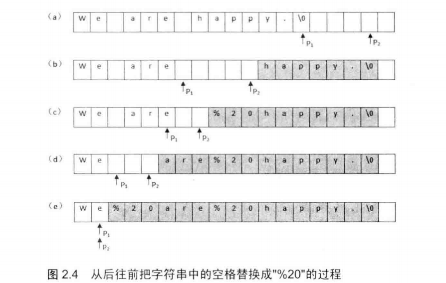

#### 2. 单例模式

```python
class Singleton(object):
    __instance = None
    __is_first = True

    def __new__(cls, age, name):
        if not cls.__instance:
            cls.__instance = object.__new__(cls)
        return cls.__instance

    def __init__(self, age, name):
        if self.__is_first:
            self.age = age
            self.name = name
            Singleton.__is_first = False
```

注意：

* `__new__`中调用 `object` 的 new 方法
* `__new__`中需要返回 `id`
* `__init__`需要将类属性设置为`False`
* 只适用于**单线程**，**多线程**需要**加锁**


## 2.3数据结构

### 2.3.1 数组

#### 4. 二维数组中的查找

* 从右上角开始查找
  * key 大于 则排除一行 ( 第一行 )
  * key 小于 则排除一列 ( 最后一列 )
* 改进：使用二分法查找来排除，可能一下子排除一半

测试用例：

* 不能找到：1. 比最大的大 ；2. 比最小的小；3. 在中间
* 能找到：1. 最大值，2. 最小值, 3. 中间值
* 特殊输入：None

### 2.3.2 字符串

#### 5. 替换空格

考点：

* O($n^2$)

* inplace ，先计算新字符串长度( 遍历，找出空格数目 )，再从后往前遍历，找到字符串合适的位置 O(n)
* 
* 内存覆盖( 本题中，替换后原数组会变长 )
* 拓展
  * 归并排序的 merge 操作